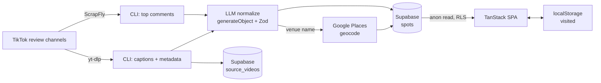

# addis-date-spots — Architecture

> Working title — rename freely. This document is the source of truth for v0 build decisions.

---

## 1. What this is

A recommendation engine for date spots around Addis Ababa. Discovery, pricing, and feedback signal come from **TikTok review channels** rather than Google Maps, because those channels surface honestly-priced spots and real audience reaction that Maps' coarse price buckets and review noise don't capture.

The system is two halves:

- **Ingestion CLI** — scrapes review channels, normalizes messy captions/comments into structured data, geocodes each venue, and writes to Supabase.
- **Deployed web app** — browse, filter and sort by price/quality, randomly pick a spot, and track where you've been.

---

## 2. Decisions log

The committed calls and why they were made, so they don't get re-litigated mid-build.

| Decision | Rationale |
|---|---|
| **Source = TikTok review channels, not Maps** | Maps gives a 1–4 `price_level` and review noise; review channels quote real birr amounts and carry genuine "is this worth it" reaction. |
| **Discovery from captions, quality from comments** | The caption holds the venue, neighborhood, and price (~80% of the signal); the comments hold the quality/aesthetic reaction. |
| **AI for normalization, not regex + lexicon** | One schema-constrained LLM pass replaces three brittle subsystems (price patterns, venue heuristics, sentiment lexicon). Decisive factor: a frequency lexicon scores "not aesthetic" / "wouldn't recommend" as *positive* and silently inflates bad spots; the LLM handles negation for free. At a few hundred items, cost is cents. |
| **Geocoding via Google Places, in the CLI only** | Resolving messy name → `{lat, lng, place_id}` is Places' job, not the LLM's. Runs server-side so the key never ships to the browser and the app never calls Google at runtime. |
| **Supabase (Postgres) as the shared store** | A deployed app needs a live data source, not a bundled JSON. CLI writes with the service role; app reads `spots` under read-only RLS. |
| **Drizzle owns the schema + migrations** | `schema.ts` is the single source of truth — tables, indexes, *and* RLS policies (`pgPolicy` + `drizzle-orm/supabase` roles), generated into migrations by `drizzle-kit`. Kills dashboard schema drift and gives the CLI typed queries. Types inferred from the schema are shared with the frontend even though the frontend reads via supabase-js. |
| **No auth in v0** | The only per-user state is "visited," which lives in browser `localStorage`. Auth is the trigger *only* when visited needs to sync across devices. |
| **Static SPA (Vite + TanStack Router), no SSR** | Reading a public dataset for a small audience — SSR buys nothing. The Supabase JS client reads directly from the browser. |
| **No geospatial index in v0** | A few hundred spots in one city → fetch all, filter/sort client-side. PostGIS is the multi-city upgrade lever, not a v0 need. |
| **Batch, not realtime** | Date spots don't churn. Run the CLI manually on your home Addis IP — better IP reputation for yt-dlp than datacenter/CI IPs. |
| **`spots` is the only table the app reads** | `channels` and `source_videos` are CLI-internal provenance; the app only ever needs the deduped, normalized venues. |

---

## 3. Components

### 3.1 Ingestion CLI — Bun + TypeScript

A single command-line tool. Stages, in order:

1. **Enumerate** — `yt-dlp --flat-playlist` over each tracked channel URL to list its videos.
2. **Fetch metadata** — `yt-dlp --skip-download --dump-json` per video → caption, hashtags, view/like/comment/share counts, timestamp, thumbnail. Free, unlimited, no key. Throttled with `--sleep-interval`.
3. **Fetch top comments** — ScrapFly (free tier) for the top ~20 comments per video, sorted by likes. This is the only metered step; scoped to the videos you want quality-scored.
4. **Normalize** — Vercel AI SDK `generateObject` + Zod, one pass per video: `caption + topComments → { venueName, neighborhood, price, tags, dimensions, evidence, summary }`. Default model: Gemini 3 Flash (pluggable).
5. **Geocode** — Google Places Text Search on `venueName + neighborhood + "Addis Ababa"` → `{ place_id, lat, lng, formatted_address, price_level (fallback) }`.
6. **Upsert** — dedup venues by `google_place_id`, write `spots`, link `source_videos.spot_id`, maintain `spots.video_count`. DB access via Drizzle over a direct Postgres connection (`drizzle-orm/postgres-js`), which bypasses RLS.

Provenance is preserved in `source_videos`, so re-normalization (e.g. after tuning the prompt or scoring weights) runs **without re-scraping** — reprocess rows where `normalized_at IS NULL` or force a full re-run.

### 3.2 Supabase (Postgres)

Three tables — `channels`, `source_videos`, `spots` — defined in `schema.ts` (Drizzle) and migrated with `drizzle-kit`; RLS policies are declared in the same file. The app reads only `spots`. See `schema.ts` for the authoritative definitions and `schemas.md` for the companion docs, indexes, and RLS explanation.

**Two access paths, one boundary:** the CLI writes through Drizzle on a direct Postgres connection (bypasses RLS); the web app reads `spots` through `@supabase/supabase-js` (anon key, RLS-enforced). This isn't redundancy — it's writer vs. reader, and the browser never holds a direct DB connection.

### 3.3 Web app — Vite + TanStack Router SPA

- Reads `spots` via `@supabase/supabase-js` (anon key).
- **Map**: Leaflet + OpenStreetMap tiles. Rendered client-only — Leaflet touches `window` on import, so lazy-load the map component to avoid SSR/build issues.
- **Filter/sort**: by `price_level` and `quality_score`, plus `neighborhood` and `tags`.
- **Random picker**: client-side pick from the already-loaded, filtered set, excluding visited (visited lives client-side, so the exclusion must too).
- **Visited tracker**: `localStorage`, keyed per the schema in `schemas.md`.

---

## 4. Data flow

---

## 5. Ingestion pipeline — detail

- **Throttle yt-dlp.** Use `--sleep-interval 2 --max-sleep-interval 5`. TikTok blocks fast/uniform request patterns and blocks tend to stick. At batch-of-a-few-hundred run once, this is a non-issue.
- **Comments are the metered step.** Pull top comments only on videos worth scoring. ScrapFly's free 1,000 credits comfortably cover a v0 batch; LamaTok (100 free) or EnsembleData are fallbacks.
- **Normalization contract.** The Zod schema in `schemas.md` is the exact shape `generateObject` must return. `temperature: 0`. `venueName` may be `null` when the caption names no identifiable place — drop those (or, later, recover via whisper.cpp on the audio).
- **Dedup on `google_place_id`.** Multiple videos → one `spot`. Accumulate `video_count` and append evidence; recompute `quality_score` on each upsert.
- **Scoring is deterministic and done in the CLI**, not by the model — the LLM returns structured dimension scores; the CLI computes the final sortable `quality_score` (formula in `schemas.md`). This keeps the score debuggable.

---

## 6. Web app — detail

- **Reads.** `select * from spots` (a few hundred rows) in one query, cached in memory; filter/sort/search happen client-side. No per-keystroke round trips.
- **Random picker.** `pick = filteredSpots.filter(notVisited)[random]`. Optional "surprise me" ignores filters.
- **Visited.** Read/write `localStorage` under `addis-date-spots:visited`. A spot's card shows a "been here" toggle; toggling writes `{ placeId, name, visitedAt, rating?, notes? }`.
- **Map.** One marker per spot, popup with name/price/score/tags and a link to a source video. Recenter on Addis by default.

---

## 7. Keys & security

| Key | Lives in | Never in |
|---|---|---|
| **`DATABASE_URL`** (direct Postgres connection, used by Drizzle) | CLI env only | the browser |
| Supabase **service role** | CLI env only | the browser |
| Supabase **anon** | the browser (app) | — (RLS makes it read-only to `spots`) |
| Google Places key | CLI env only | the browser |
| ScrapFly key | CLI env only | the browser |
| LLM provider key | CLI env only | the browser |

The app ships exactly one credential — the anon key — and it can only `select` from `spots`. Every write/geocode/scrape key stays in the CLI.

---

## 8. Deployment

- **CLI** — runs locally on your Manjaro box (home Addis IP). No hosting needed for v0.
- **Migrations** — `drizzle-kit generate` + `migrate` from the CLI project, run against Supabase before the first ingestion.
- **Web app** — static build deployed to Vercel / Netlify / Cloudflare Pages. Two public env vars: Supabase URL + anon key.
- **Supabase** — hosted free tier.

---

## 9. Cost — entirely free tier at v0 volume

| Piece | Cost |
|---|---|
| yt-dlp (captions, metadata, channel listing) | Free, unlimited |
| ScrapFly comments | Free 1,000 credits, no card |
| LLM normalization | Cents (a few hundred calls) |
| Google Places geocoding | Within free monthly credit |
| Supabase | Free tier |
| Static hosting | Free tier |

---

## 10. Out of scope for v0 (future levers)

- **Auth + cross-device visited** — add Better Auth (or Supabase Auth) and a `visits` table only when visited needs to sync beyond one browser.
- **PostGIS "near me"** — enable when you go multi-city; single-city scale doesn't need it.
- **whisper.cpp fallback** — transcribe audio to recover venues named only in-video (reuses your Reels pipeline tooling).
- **Automated refresh** — a scheduled worker; budget for residential proxies since CI IPs get blocked by TikTok.
- **Multi-city** — partition `spots` by a `city` column; revisit indexing/geo.

---

## 11. Open TODO before/while building

1. Rename the project.
2. Choose the initial list of review channels to track.
3. Tune the price buckets and `quality_score` weights against real scraped data (defaults in `schemas.md` are starting points).
